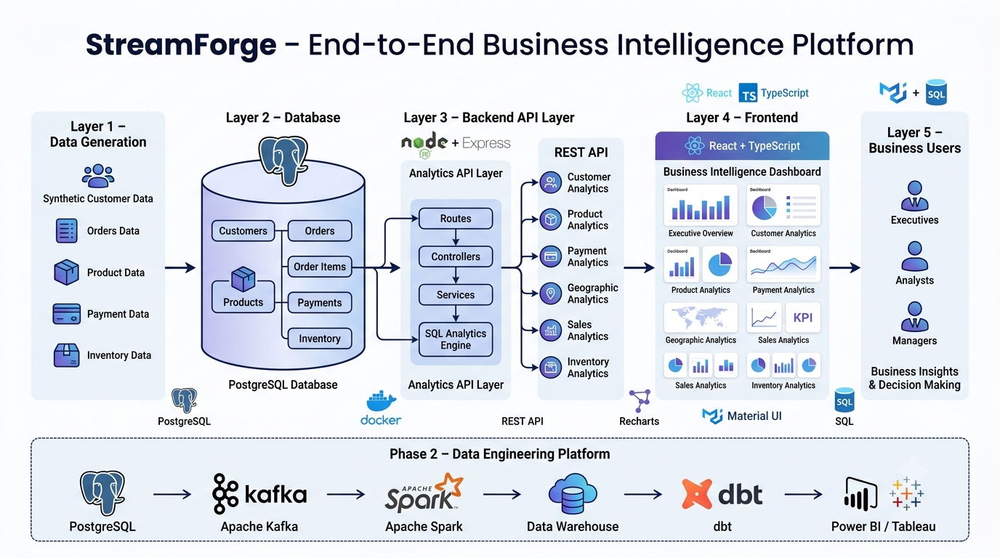

# 🚀 StreamForge

<p align="center">
  
</p>

> **An End-to-End Business Intelligence Platform for Modern Retail Analytics**

StreamForge is a production-inspired Business Intelligence platform built to demonstrate how modern data-driven applications transform raw business data into actionable insights.

The project simulates a real-world retail analytics environment by combining a scalable backend, relational database, analytics APIs, and an interactive frontend dashboard.

Unlike a traditional dashboard project, StreamForge follows a layered architecture where business data is collected, processed, analyzed, and presented through dedicated analytics modules.

---

# 📖 Project Overview

Modern organizations generate massive amounts of operational data every day. Customer information, orders, payments, products, and inventory records often exist across multiple systems, making it difficult for business teams to obtain meaningful insights.

StreamForge addresses this challenge by providing a centralized Business Intelligence platform capable of delivering:

* Customer Analytics
* Product Analytics
* Payment Analytics
* Geographic Analytics
* Sales Analytics
* Inventory Analytics

The platform exposes analytics through REST APIs and visualizes them using interactive dashboards designed for executives, analysts, and business users.

---

# 🎯 Project Objectives

The primary objectives of StreamForge are:

* Design a scalable full-stack analytics platform
* Build clean REST APIs following layered architecture
* Develop interactive executive dashboards
* Implement realistic business analytics using SQL
* Demonstrate software engineering and system design skills
* Serve as the foundation for an enterprise-grade Data Engineering platform

---

# 🏗️ Architecture

```
                    React + TypeScript
                           │
                           │
                  React Query + Axios
                           │
                           ▼
                 Node.js + Express APIs
                           │
                           ▼
                  Business Service Layer
                           │
                           ▼
                     PostgreSQL Database
                           │
        ┌──────────┬──────────┬──────────┐
        │          │          │          │
    Customers   Orders   Products   Payments
        │
    Inventory
```

The application follows a layered architecture that separates presentation, business logic, and data access, making the system easier to maintain, extend, and scale.

---

# ✨ Features

## Executive Dashboard

* Business KPIs
* Revenue Overview
* Customer Overview
* Product Overview
* Payment Overview
* Inventory Summary

---

## Customer Analytics

* Customer KPIs
* Customer Growth
* Customer Segmentation
* Top Customers
* Geographic Distribution

---

## Product Analytics

* Product KPIs
* Product Revenue
* Brand Revenue
* Category Revenue
* Inventory Value
* Product Pricing
* Low Stock Analysis
* Top Performing Products

---

## Payment Analytics

* Payment KPIs
* Payment Method Distribution
* Payment Status Analysis
* Monthly Revenue Trends

---

## Geographic Analytics

* Geographic KPIs
* Customers by Country
* Customers by City
* Revenue by City

---

## Sales Analytics

* Monthly Sales
* Revenue Trends
* Order Analytics
* Business Performance Metrics

---

## Inventory Analytics

* Inventory KPIs
* Stock Levels
* Warehouse Analysis
* Inventory Value
* Low Stock Monitoring

---

# 🛠️ Technology Stack

## Frontend

* React
* TypeScript
* Material UI
* React Query
* Axios
* Recharts

---

## Backend

* Node.js
* Express.js
* REST APIs

---

## Database

* PostgreSQL
* SQL
* Relational Data Modeling

---

## Development

* Docker
* Git
* GitHub

---

# 📂 Project Structure

```
streamforge/

├── frontend/
│   ├── src/
│   │   ├── pages/
│   │   ├── hooks/
│   │   ├── services/
│   │   ├── components/
│   │   └── layouts/
│
├── backend/
│   ├── controllers/
│   ├── routes/
│   ├── services/
│   ├── middleware/
│   └── config/
│
├── database/
│   ├── migrations/
│   └── seeds/
│
├── docs/
│
└── docker/
```

---

# 📊 Business Intelligence Modules

The platform currently includes multiple analytics domains:

| Module               | Status |
| -------------------- | ------ |
| Overview Dashboard   | ✅      |
| Customer Analytics   | ✅      |
| Product Analytics    | ✅      |
| Payment Analytics    | ✅      |
| Geographic Analytics | ✅      |
| Sales Analytics      | ✅      |
| Inventory Analytics  | ✅      |

---

# 🗄️ Database Design

The system is centered around a relational retail database.

Core entities include:

* Customers
* Orders
* Order Items
* Products
* Payments
* Inventory

Relationships are implemented using primary and foreign keys to ensure data consistency and realistic business modeling.

---

# 📈 Analytics

StreamForge performs business analytics directly on transactional data using optimized SQL queries.

Examples include:

* Revenue Analysis
* Customer Segmentation
* Monthly Growth
* Product Performance
* Payment Success Rates
* Geographic Distribution
* Inventory Monitoring

---

# 🚀 Running the Project

## Backend

```bash
cd backend

npm install

npm run dev
```

---

## Frontend

```bash
cd frontend

npm install

npm run dev
```

---

## Database

Configure PostgreSQL and update the environment variables before starting the backend.

---

# 📸 Screenshots

The following screenshots will be added after completing the project.

* Executive Dashboard
* Customer Analytics
* Product Analytics
* Payment Analytics
* Geographic Analytics
* Sales Analytics
* Inventory Analytics

---

# 🧠 Engineering Principles

This project emphasizes:

* Clean Architecture
* Separation of Concerns
* Layered Backend Design
* Reusable Components
* Modular APIs
* Scalable Folder Structure
* Maintainable Codebase
* Business-Oriented Analytics

---

# 🗺️ Roadmap

## ✅ Phase 1 — Business Intelligence Platform

* Interactive Dashboard
* Analytics APIs
* SQL Analytics
* Business KPIs
* Full Stack Application

---

## 🚧 Phase 2 — Data Engineering Platform

The next phase transforms StreamForge into a complete modern data platform by introducing:

* Apache Kafka
* Apache Spark
* Data Warehouse
* dbt
* Apache Airflow
* Dimensional Modeling
* ETL/ELT Pipelines
* Power BI / Tableau Dashboards

This evolution demonstrates the complete lifecycle from transactional systems to enterprise-scale analytics.

---

# 🎥 Project Walkthrough

A complete technical walkthrough will accompany this project, covering:

* Business Problem
* System Architecture
* Database Design
* Backend Development
* Frontend Development
* Analytics Implementation
* Dashboard Demonstration
* Future Roadmap

---

# 👨‍💻 Purpose

StreamForge was built as a portfolio project to demonstrate full-stack software engineering, analytics engineering, and business intelligence skills through a production-inspired architecture suitable for real-world enterprise applications.

---

## ⭐ If you found this project useful, consider giving it a star.
